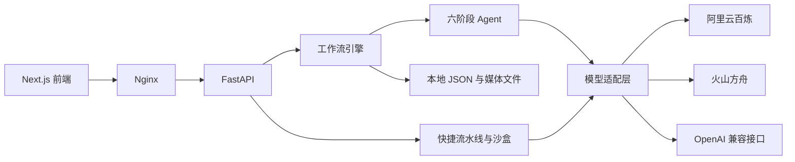

# 幕间 Mujian

幕间是从创意到成片的 AI 视频创作工作台，可把一句故事梗概制成短片，并以只读展示模式供面试官浏览。

## 功能

- **六阶段主流程**：剧本生成 → 角色与场景设计 → 分镜 → 参考图 → 视频片段 → 后期成片。「快速演示」预设将内容限定为一集、约 30 秒、720P。
- **三条快捷流水线**：文艺短片、动作迁移、数字人口播。
- **沙盒**：独立试用图片与视频模型，查看历史结果。
- **展示模式**：管理员生成作品、标记示例并管理邀请码；面试官登录后只能浏览示例与已开放的历史，不能发起生成。
- **费用保护**：按模型注册表价格预留图片和视频生成额度，限制每日估算金额与并发任务数。实际费用以模型平台账单为准。



## 本地运行

需要 Python 3.11、Node.js 20、npm、[uv](https://docs.astral.sh/uv/) 和 ffmpeg。也可以先运行 `scripts/install.sh` 安装依赖。

```bash
cd backend
uv sync --python 3.11
cp config.yaml.example config.yaml
# 在本地 config.yaml 中填写所需 API Key
uv run python api_server.py
```

在另一个终端启动前端：

```bash
cd frontend
npm ci
npm run dev
```

前端默认地址是 `http://127.0.0.1:3000`，后端健康检查是 `http://127.0.0.1:8000/api/health`。本地默认无需登录。模型默认值及平台地址在 `backend/config.yaml` 中设置；可用环境变量 `DASHSCOPE_API_KEY`、`ARK_API_KEY`、`OPENAI_COMPAT_API_KEY` 覆盖密钥。通用兼容接口只用于文本和视觉理解。`config.yaml` 和 `.env` 均被 Git 忽略。

运行全部检查：

```bash
./scripts/check.sh
```

## 部署与数据

[部署手册](deploy/README.md)说明 Docker Compose、公开展示模式、邀请码、域名与 HTTPS。三服务分别是 `backend`、`frontend`、`nginx`。会话、产物、邀请码和用量记录保存在 `backend/code/`，不进入 Git；升级前请备份该目录。

项目结构：`backend/` 包含 API、工作流、模型适配与 JSON 存储；`frontend/` 包含 Next.js 页面和前端回归测试；`deploy/` 包含 Nginx 配置与部署手册；`scripts/` 包含安装与检查脚本。[五分钟演示脚本](docs/demo-script.md)可用于面试展示。

## 许可证

本项目采用 [MIT 许可证](LICENSE)。所用第三方代码的必要版权与许可声明见 [THIRD_PARTY_NOTICES.md](THIRD_PARTY_NOTICES.md)。
